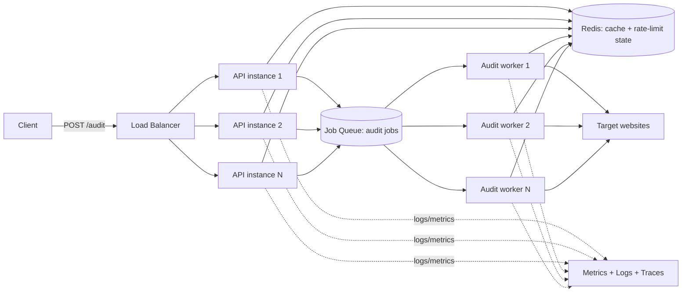

# Architecture — Page Pulse at Scale

**Target load:** 10,000 audits/day (~7/min average), bursts of 500
concurrent requests, customer-facing response-time SLA.

## Current (Task A) design — and why it stops working here

Task A's service is a single process: in-memory cache, in-memory rate
limiter, in-memory concurrency semaphore. That's fine for one instance.
At 500 concurrent requests it isn't — one process queues everything
past `AUDIT_MAX_CONCURRENCY` (10) behind a single event loop, and if we
scale to multiple instances behind a load balancer, each instance has
its *own* cache and rate-limit state, so a client bouncing between
instances effectively gets no rate limiting and a much lower cache hit
rate than the numbers suggest.

## Target architecture

### Components

- **API layer (stateless, horizontally scaled).** Accepts requests,
  validates input, checks the shared cache. On a cache hit, returns
  immediately. On a miss, enqueues an audit job and either (a) waits
  synchronously up to a short budget for fast targets, or (b) returns
  `202 Accepted` with a poll/webhook path for slow targets — decision
  driven by the SLA, see below.
- **Shared cache (Redis).** Replaces the in-memory `TtlCache`. Same
  interface, different backend — this is exactly why Task A's cache was
  built behind a small interface rather than exposing `Map` directly.
- **Job queue (Redis-backed, e.g. BullMQ, or SQS if we're on AWS).**
  Decouples "accept the request" from "do the slow network fetch."
  This is the single biggest change from Task A: outbound fetches move
  off the request-handling path entirely.
- **Worker pool.** Pulls jobs, runs the actual audit (same logic as
  Task A's `runAudit`), writes the result to the cache, and either
  fulfills the waiting synchronous request or fires a webhook/updates a
  job-status record for async clients.
- **Rate limiting**, moved to Redis-backed counters (e.g. a Lua-scripted
  token bucket) so limits are enforced across all API instances, not
  per-process.

### Where state lives

| State | Task A (single process) | At scale |
|---|---|---|
| Audit result cache | In-process `Map` | Redis, shared |
| Rate-limit buckets | In-process `Map` | Redis, shared |
| In-flight concurrency count | In-process semaphore | Queue depth + worker pool size |
| Job status (async path) | N/A | Redis or Postgres row per job |

### Handling the SLA

Two audit types have very different response-time profiles: a fast,
small page (200ms) versus a slow or hanging site (up to our timeout,
8s+). A single synchronous SLA across both is unrealistic. The design:

- **Fast path:** if the target responds within e.g. 3s, return the
  result synchronously — most audits fall here.
- **Slow path:** if the worker hasn't finished within that budget,
  return `202 Accepted` with a `statusUrl`. The SLA becomes "we
  acknowledge your request within Xms," not "we always fetch the
  target within Xms" — because we don't control the target's latency.
  This distinction should be made explicit in whatever SLA doc goes to
  customers.

### Capacity math (rough)

10,000/day ≈ 7/min average, but bursts of 500 concurrent is the number
that actually sizes the system. With a worker doing one fetch at a time
and an average upstream response of ~1–2s, 500 concurrent in-flight
audits needs roughly 500 concurrent worker "slots" — not 500 processes,
but enough concurrency across the worker pool (Node workers handle many
concurrent I/O-bound fetches per process; the real ceiling is upstream
bandwidth and file descriptors, not CPU). Plan for horizontal worker
scaling triggered by queue depth, not fixed worker count.
